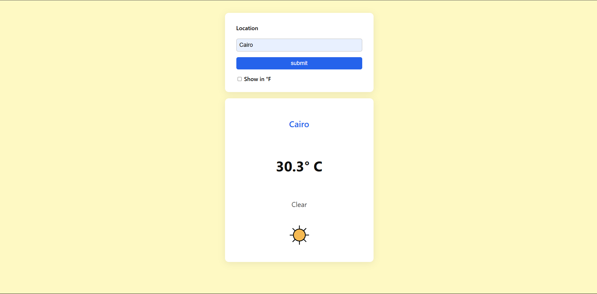

# Weather App

A simple weather app built with HTML, CSS, and JavaScript. Enter any location to get the current weather, temperature, and condition, with an option to toggle between Celsius and Fahrenheit.

## Features

- Search weather by city or location name
- Toggle between °C and °F
- Responsive and clean design
- Weather icon and background color change based on condition
- Loading indicator and error handling

## Demo

[Live Demo](https://mohamedmosilhy.github.io/weather-app/)

## Screenshot

## Technologies

- HTML
- CSS
- JavaScript
- [Visual Crossing Weather API](https://www.visualcrossing.com/weather-api)
